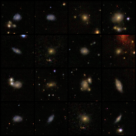

# Physics-Aware Galaxy Generation with Conditional GANs

A deep learning framework for generating scientifically valid galaxy images using Conditional GANs with physics-aware loss functions. Enforces astrophysical parameter consistency while generating realistic galaxy morphologies from the Galaxy Zoo 2 dataset.

## Key Features

- **Physics-Aware Loss**: Auxiliary loss enforces astrophysical parameter consistency
- **Multi-Attribute Conditioning**: Control over 4 morphology classes and 4 physical parameters
- **Rare Class Generation**: Generate underrepresented morphologies (mergers, edge-on galaxies)
- **Scientific Validation**: Physics loss < 0.01 demonstrates strong attribute matching

## Morphology Classes

1. **Spiral** - Disk galaxies with spiral arms
2. **Elliptical** - Smooth, featureless morphologies
3. **Merger** - Interacting galaxy systems
4. **Edge-on** - Disk galaxies viewed from the side

## Physical Parameters

- **Size**: Galaxy angular size (0.3 - 1.0)
- **Brightness**: Apparent brightness (0.2 - 1.0)
- **Ellipticity**: Shape ellipticity (0.0 - 0.9)
- **Redshift**: Cosmological redshift (0.0 - 0.5)

## Generated Samples

Generated galaxies from epoch 40 showing diverse morphologies and physical attributes:



## Installation

```bash
# Clone repository
git clone https://github.com/Hassan-Ilyas-Virk/Galaxy-Generation-CGANs.git
cd Galaxy-Generation-CGANs

# Install dependencies
pip install -r requirements.txt
```

### Requirements

- Python 3.8+
- PyTorch 2.0+
- CUDA-capable GPU (RTX 3070 or better)
- 5GB disk space for checkpoints

## Dataset

**Galaxy Zoo 2** (Hart et al. 2016) - ~300,000 galaxy images with morphology classifications

- **Images**: [Zenodo](https://zenodo.org/record/3565489)
- **Labels**: [data.galaxyzoo.org](https://data.galaxyzoo.org/)

Place data in `data/` directory:
```
data/
├── gz2_hart16.csv
└── images_gz2/images/
```

## Usage

### Training

```bash
# Train GAN (default)
python galaxy.py

# Train diffusion model
python galaxy.py --diffusion

# Resume training
python resume_training.py
```

### Generation

```bash
# Generate from checkpoint
python generate_from_checkpoint.py

# Run web interface
python app.py
```

## Architecture

### Generator
- Input: 100D noise + 8D condition (4 morphology + 4 physical attributes)
- Architecture: DCGAN with 4 transposed conv layers
- Output: 64×64 RGB image (~2.5M params)

### Discriminator
- Input: 64×64 image + 8D condition
- Architecture: 4 conv layers with BatchNorm
- Output: Real/fake probability (~1.8M params)

### Physics Predictor
- Purpose: Ensures generated galaxies match requested attributes
- Architecture: 3 conv + 2 FC layers
- Output: 4D predicted attributes (~450K params)

## Training Configuration

| Parameter | Value |
|-----------|-------|
| Batch Size | 64 |
| Learning Rate | 0.00015 |
| Epochs | 150 |
| Physics Weight (λ) | 3.0 |
| Training Time (RTX 3070) | ~4.5 hours |

## Loss Functions

**Discriminator:**
```
L_D = BCE(D(real, c), 0.9) + BCE(D(G(z, c), c), 0.1)
```

**Generator (Physics-Aware):**
```
L_G = L_GAN + λ_physics × L_physics
where L_physics = MSE(PhysicsPredictor(G(z, c)), c_physical)
```

## Results

**Final Metrics (Epoch 150):**
- Discriminator Loss: ~0.68
- Generator Loss: ~0.72
- Physics Loss: ~0.006 (excellent matching)
- No mode collapse observed

## Project Structure

```
├── galaxy.py                    # Main training script
├── gan_model.py                 # GAN architecture
├── physics_model.py             # Physics predictor
├── diffusion_model.py           # Diffusion model
├── config_physics.py            # Configuration
├── resume_training.py           # Resume training
├── generate_from_checkpoint.py  # Generation script
├── app.py                       # Flask web server
├── checkpoints/                 # Model checkpoints
├── samples/                     # Generated samples
└── data/                        # Galaxy Zoo 2 data
```

## Documentation

- [PROJECT_REPORT.md](PROJECT_REPORT.md) - Comprehensive project report
- [DATA_USAGE.md](DATA_USAGE.md) - Dataset documentation
- [runcommands.md](runcommands.md) - Quick command reference

## References

1. Hart, R. E., et al. (2016). Galaxy Zoo: comparing the demographics of spiral arm number. *MNRAS*, 461(4), 3663-3682.
2. Lanusse, F., et al. (2021). Deep generative models for galaxy image simulation. *A&A*, 646, A13.
3. Radford, A., et al. (2015). Unsupervised representation learning with DCGANs. *arXiv:1511.06434*.
4. Mirza, M., & Osindero, S. (2014). Conditional generative adversarial nets. *arXiv:1411.1784*.

## License

Educational and research purposes. Galaxy Zoo 2 dataset used under original license terms.

## Citation

```bibtex
@misc{physics-aware-galaxy-gan,
  title={Physics-Aware Galaxy Generation with Conditional GANs},
  year={2025},
  url={https://github.com/Hassan-Ilyas-Virk/Galaxy-Generation-CGANs}
}
```
